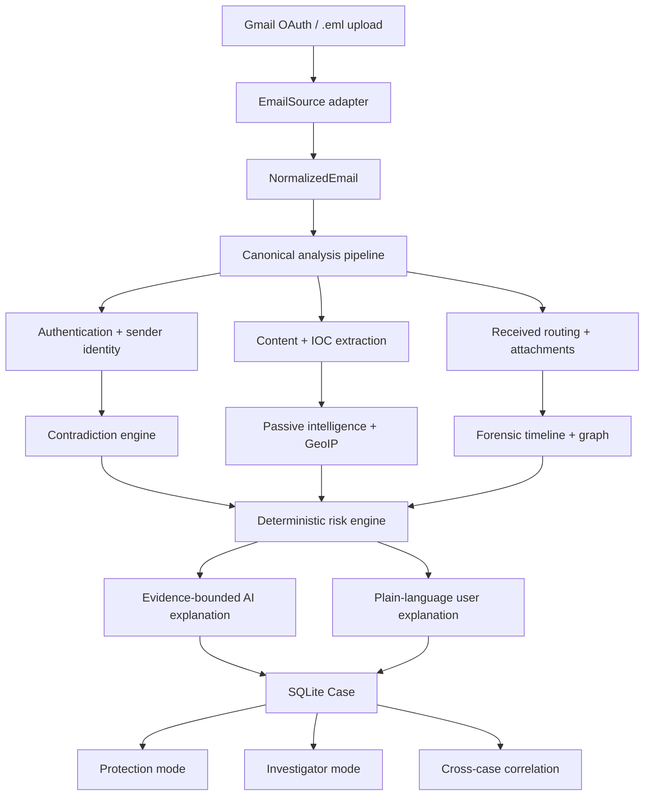

# ForensiQ Architecture

```mermaid
graph TD
    A[Gmail OAuth / .eml upload] --> B[EmailSource adapter]
    B --> C[NormalizedEmail]
    C --> D[Canonical analysis pipeline]
    D --> D1[Authentication + sender identity]
    D --> D2[Content + IOC extraction]
    D --> D3[Received routing + attachments]
    D1 --> E[Contradiction engine]
    D2 --> F[Passive intelligence + GeoIP]
    D3 --> G[Forensic timeline + graph]
    E --> H[Deterministic risk engine]
    F --> H
    G --> H
    H --> I[Evidence-bounded AI explanation]
    H --> J[Plain-language user explanation]
    I --> K[SQLite Case]
    J --> K
    K --> L[Protection mode]
    K --> M[Investigator mode]
    K --> N[Cross-case correlation]
```
